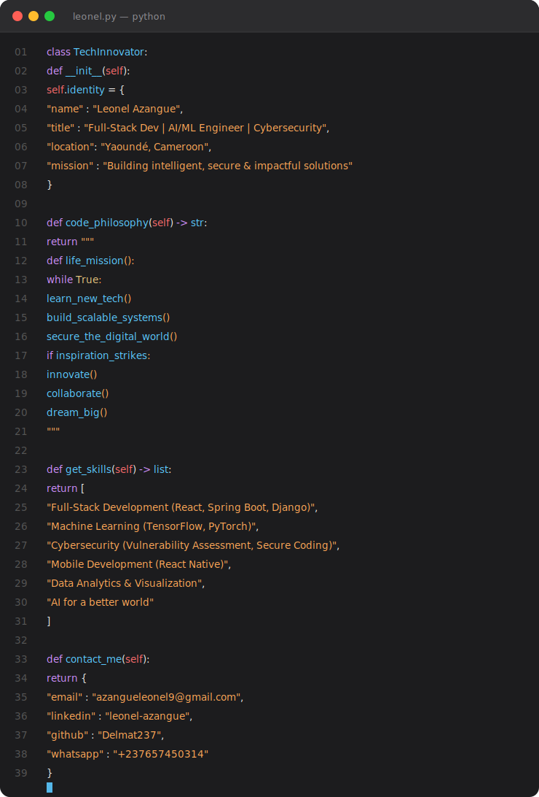

---

<!-- Snake Animation -->

  <picture>
    <source media="(prefers-color-scheme: dark)" srcset="https://github.com/7oSkaaa/7oSkaaa/blob/output/github-contribution-grid-snake-dark.svg?">
    <source media="(prefers-color-scheme: light)" srcset="https://github.com/7oSkaaa/7oSkaaa/blob/output/github-contribution-grid-snake.svg?">
    
  </picture>

---

##  À Propos de Moi

Je suis **Leonel Azangue**, un **développeur full-stack**, **ingénieur en IA/ML**, et **apprenant en cybersécurité** basé à **Yaoundé, Cameroun** 🌍.

Passionné par la création de solutions technologiques innovantes, je combine des interfaces modernes avec des backends sécurisés et des algorithmes d'intelligence artificielle pour résoudre des problèmes du monde réel.

 

  

---

## 🚀 Projets Phares

### ⭐ Projet Mis en Avant

- **📊 DATAORG — Financial Health Prediction** : Implémentation d'un modèle de machine learning pour **prédire la santé financière des individus**, basé sur la compétition **data.org Financial Health Prediction Challenge** de Zindi. Feature engineering avancé, pipeline ML complet.  
  

---

### 🧠 IA & Machine Learning

- **🤖 ALD-Talker** : Système d'avatar conversationnel intelligent combinant **LLMs + modèles visuels** pour une nouvelle dimension d'interaction humain-IA. Fork enrichi de Linly-Talker.  
  

- **🎓 EduSmart** : Plateforme d'e-learning alimentée par l'IA avec apprentissage adaptatif, support multilingue, et certifications blockchain.  
  

---

### 🌐 Web & Communauté

- **🖱️ Cursor Cameroun** : Site officiel de la communauté Cursor au Cameroun — présence digitale de l'écosystème dev local autour de l'IA et du code assisté.  
  

- **💎 DB Jewelry** : Boutique en ligne élégante pour bijoux de luxe avec navigation par catégories, panier dynamique, et design responsive.  
  

---

### 🔒 Sécurité & Réseau

- **💬 CHAT-OFFLINE (CIRR)** : Application de messagerie **sécurisée Offline-First** pour communications au sein d'un Réseau Local (LAN) sans dépendance à Internet. Pensé pour les zones à faible connectivité.  
  

- **🔍 VulnScan Pro** : Outil de sécurité automatisé pour l'évaluation des vulnérabilités avec intégration CVE et rapports conformes.  
  

---

## 📊 Statistiques GitHub

<!-- Activity Graph -->

<!-- Trophy -->

---

## 🛠️ Outils & Technologies

###  Langages & Frameworks

  

###  IDEs & Outils de Développement

  
  
  
  

###  Outils de Cybersécurité

  
  
  
  
  

###  Systèmes d'Exploitation

  
  
  
  

---

## 🤝 Contributions

<table>
  <tr>
    <td>
      
    </td>
    <td>
      
    </td>
  </tr>
  <tr>
    <td>
      
    </td>
    <td>
      
    </td>
  </tr>
</table>

---

## 💭 Citation

> *"La technologie doit être intuitive, sécurisée et transformative. Construisons un avenir meilleur, un commit à la fois."*  
> **— Leonel Azangue**

---

## 📞 Me Contacter

  
  
  
  

