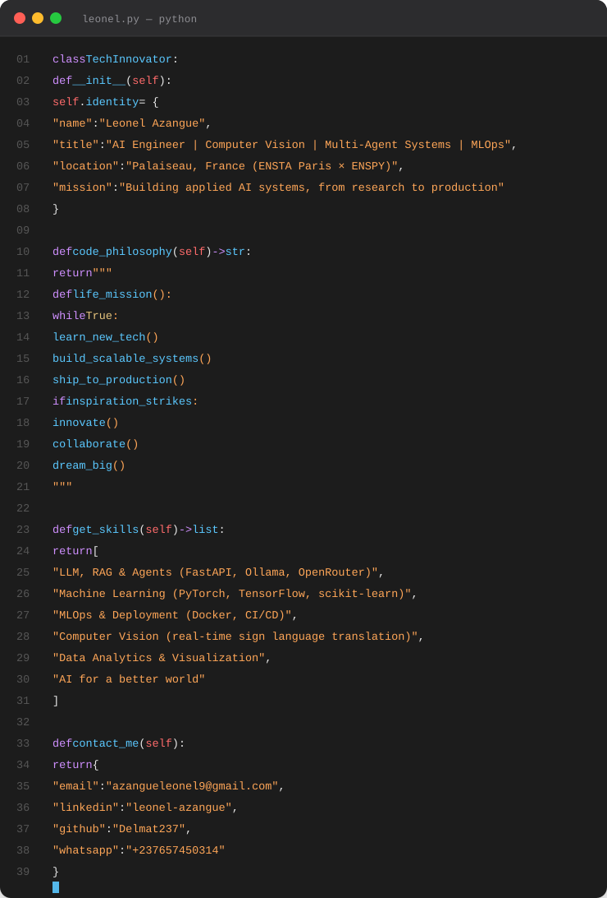

  <picture>
    <source media="(prefers-color-scheme: dark)" srcset="https://raw.githubusercontent.com/Delmat237/Delmat237/output/github-snake-dark.svg">
    <source media="(prefers-color-scheme: light)" srcset="https://raw.githubusercontent.com/Delmat237/Delmat237/output/github-snake.svg">
    
  </picture>

# Leonel Delmat Azangue

**Élève-ingénieur · ENSTA Paris (Informatique) × ENSPY — double diplôme**
Intelligence artificielle · Vision par ordinateur · Systèmes multi-agents · MLOps

📍 Palaiseau, France · 🎓 Parcours visé : Data & Intelligence Artificielle
🌐 [Portfolio](https://azangue-leonel-portfolio.vercel.app) · 💼 [LinkedIn](https://www.linkedin.com/in/leonel-azangue) · ✉️ [azangueleonel9@gmail.com](mailto:azangueleonel9@gmail.com)

---

  

## À propos

Je construis des systèmes d'IA appliqués, de la recherche d'une bonne approche jusqu'au déploiement :
modèles de ML, pipelines RAG et agents, avec un soin particulier pour l'évaluation et la robustesse.
Je cherche actuellement un **projet de recherche (PRe)** en IA appliquée : perception et vision,
modèles autonomes, systèmes multi-agents, apprentissage.

## Axes de travail

| Domaine | Ce que j'ai construit |
|---|---|
| **LLM, RAG & agents** | Plateforme RAG hybride cloud/local avec bascule automatique hors-ligne, multilingue ([AI_Agent_RAG_SYSTEM](https://github.com/Delmat237/AI_Agent_RAG_SYSTEM)) · avatar conversationnel LLM + vision ([ALD-Talker](https://github.com/Delmat237/ALD-Talker)) |
| **Machine learning** | Prédiction de santé financière, challenge Zindi / data.org ([DATAORG](https://github.com/Delmat237/DATAORG_FINANCIAL-HEALTH-PREDICTION)) · détection de fraude ([Fraud-Detection-System](https://github.com/Delmat237/Fraud-Detection-System)) · recommandation de cultures ([CROP-PREDICTION](https://github.com/Delmat237/CROP-PREDICTION)) |
| **IA à impact** | Solutions IA pour l'Hôpital Général de Douala : suivi des patients, chatbot LLM, prévision des stocks de sang ([CODE2CARE_AICELLGI](https://github.com/Delmat237/CODE2CARE_AICELLGI)) |
| **Systèmes & ingénierie** | Moteur d'instrumentation binaire dynamique en C, WiSe Hack'25 ([wise-hack25-dbi](https://github.com/Delmat237/wise-hack25-dbi)) · ERP multi-tenant Spring Boot / Kafka / Elasticsearch ([Yowyob-ERP-Accounting](https://github.com/Delmat237/Yowyob-ERP-Accounting)) |

Autres projets (traduction de la langue des signes en temps réel, IA vocale hors-ligne pour l'agriculture) : voir le [portfolio](https://azangue-leonel-portfolio.vercel.app).

## Distinctions

- 🥈 2ᵉ place — Cursor Hackathon 2026
- 🥇 1ᵉʳ prix — WiSE HACK'25
- 🥉 3ᵉ place — DataTour 2025

## Engagement

- Formateur Python / ML au Club GI de l'ENSPY ([programme de 6 mois](https://github.com/Delmat237/python-accelerated-enspy-2025))
- Ambassadeur ICSC pour le Cameroun
- Ancien coordinateur du Club GI, ancien président de l'AEIMP

## Stack

